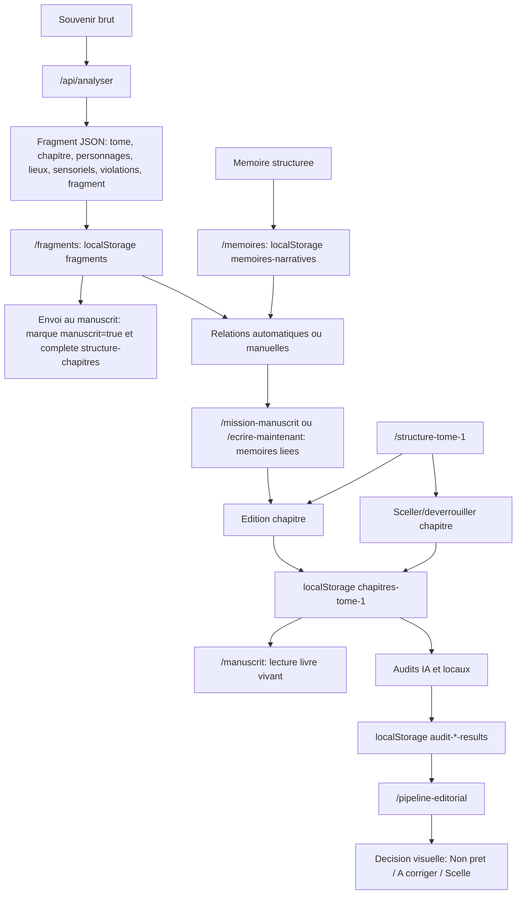

# AUDIT MODULE ECRITURE STRATE

Audit realise dans `/Users/growingandchanging/mon-app`.

Perimetre : module d'ecriture, manuscrit, souvenirs, StyleDNA, audit de voix, controle editorial, structure Tome 1, pipeline editorial, validation/scellement, prompts IA et regles globales d'ecriture.

Contraintes respectees : aucun fichier applicatif modifie, aucune donnee migree, aucune cle localStorage modifiee.

## 1. Resume executif

Le module d'ecriture STRATE est actif, mais il n'est pas encore un systeme unifie. Il fonctionne par plusieurs surfaces paralleles :

- lecture livre : `/manuscrit`;
- ecriture directe : `/ecrire-maintenant`;
- structure et scellement : `/structure-tome-1`;
- cockpit d'ecriture : `/mission-manuscrit`;
- quartier general : `/heritage-des-silences`;
- audits IA : `/audit-vibration`, `/audit-voix`, `/audit-sur-explication`, `/audit-linguistique`, `/audit-anti-ia`;
- audits locaux : `/audit`, `/audit-repetitions`, `/style-dna`, `/controle-editorial`;
- souvenirs et matiere brute : `/fragments`, `/memoires`, `/chronologie`;
- module legacy : `/biographie`.

La source canonique actuelle des chapitres Tome 1 est `localStorage["chapitres-tome-1"]`, normalisee par `lib/tome1-chapters.ts`. Cependant, des systemes concurrents subsistent : `fragments`, `memoires-narratives`, `structure-tomes`, `structure-chapitres`, anciennes cles `ecriture_*`, et `biographie-projet`.

Le scellement existe, mais il est partiel : `/structure-tome-1` bloque l'edition d'un chapitre `scelle`, tandis que `/ecrire-maintenant` peut sauvegarder un chapitre actif sans verifier ce statut.

Les prompts actifs sont majoritairement embarques directement dans les routes API. Ils ne sont pas versionnes, pas centralises, et plusieurs versions du protocole Justesse Nue coexistent.

## 2. Architecture reelle du module

| Element | Chemin | Role | Actif |
|---|---|---|---|
| Livre vivant | `/Users/growingandchanging/mon-app/app/manuscrit/page.tsx` | Lecture paginee, export texte, diagnostic local, memoire active | Oui |
| Source Tome 1 | `/Users/growingandchanging/mon-app/lib/tome1-chapters.ts` | Types, metadata, normalisation, statut editorial | Oui |
| Reconstruction manuscrit | `/Users/growingandchanging/mon-app/lib/manuscript-source.ts` | Combine chapitres, fragments et relations | Oui |
| Structure legacy | `/Users/growingandchanging/mon-app/lib/manuscript-structure.ts` | Tomes/chapitres historiques et cles `structure-*` | Oui, secondaire |
| Carte Tome 1 | `/Users/growingandchanging/mon-app/app/structure-tome-1/page.tsx` | Edition, metadata, cloud Supabase, scellement | Oui |
| Ecrire maintenant | `/Users/growingandchanging/mon-app/app/ecrire-maintenant/page.tsx` | Editeur principal local | Oui |
| Mission manuscrit | `/Users/growingandchanging/mon-app/app/mission-manuscrit/page.tsx` | Cockpit et recommandation du chapitre a travailler | Oui |
| Quartier general | `/Users/growingandchanging/mon-app/app/heritage-des-silences/page.tsx` | Accueil manuscrit, dernier chapitre, dernier souvenir | Oui |
| Pipeline editorial | `/Users/growingandchanging/mon-app/app/pipeline-editorial/page.tsx` | Suivi audits, notes, statut de scellement | Oui |
| Controle editorial | `/Users/growingandchanging/mon-app/components/ControleEditorial.tsx` | Tableau local des risques voix/style/motifs/sauvegarde | Oui |
| StyleDNA | `/Users/growingandchanging/mon-app/components/StyleDNA.tsx` | Analyse locale style/voix chapitre par chapitre | Oui |
| Memoire editoriale | `/Users/growingandchanging/mon-app/lib/editorial-memory.ts` | Motifs, respirations, repetitions, densite | Oui |
| Directeur editorial | `/Users/growingandchanging/mon-app/lib/editorial-director.ts` | Diagnostic strategique 360 | Oui |
| Repetitions avancees | `/Users/growingandchanging/mon-app/lib/editorial-repetitions.ts` | Lexique, expressions, ouvertures, fermetures, motifs | Oui |
| Fragments | `/Users/growingandchanging/mon-app/lib/fragments.ts` | Coffre de fragments | Oui |
| Mémoires narratives | `/Users/growingandchanging/mon-app/lib/memoire-narrative.ts` | Souvenirs structures | Oui |
| Relations narratives | `/Users/growingandchanging/mon-app/lib/narrative-relations.ts` | Liens fragments/memoires/scenes/chapitres | Oui |
| Scenes | `/Users/growingandchanging/mon-app/lib/scenes.ts` | Types de scenes relationnelles | Oui |
| Biographie legacy | `/Users/growingandchanging/mon-app/app/lib/biographie.ts` | Ancien projet narratif local | Legacy actif |

## 3. Routes actives

Routes explicitement verifiees :

- `/manuscrit` : existe, lecture paginee du Tome 1 depuis `chapitres-tome-1`, fragments, scenes, relations, couverture locale.
- `/heritage-des-silences` : existe, quartier general du manuscrit.
- `/pipeline-editorial` : existe, lit audits et notes, ne scelle pas directement.
- `/audit-voix` : existe, appelle `/api/audit-voix`.
- `/style-dna` : existe, rend `components/StyleDNA`.
- `/centre-intelligent` : existe dans `app/centre-intelligent/page.tsx`, hors coeur manuscrit direct.
- `/ecrire-maintenant` : existe, editeur direct.
- `/mission-manuscrit` : existe, cockpit ecriture.
- `/biographie` : existe, legacy autobiographique.
- `/structure-tome-1` : existe, carte Tome 1, edition, scellement.
- `/biographie/migration-audit` : existe, audit migration lecture seule.
- `/biographie/inventaire` : existe, inventaire multi-sources.

## 4. Sources de verite

| Domaine | Source canonique actuelle | Sources paralleles |
|---|---|---|
| Chapitres Tome 1 | `lib/tome1-chapters.ts` + `localStorage["chapitres-tome-1"]` | `app/structure-tome-1/page.tsx` contient ses propres metadata, Supabase `chapitres_tome1`, `fragments` reconstruits |
| Souvenirs bruts | `localStorage["fragments"]` via `lib/fragments.ts` | `localStorage["memoires-narratives"]`, constantes importables de `/memoires` |
| Regles editoriales | Dispersees dans `editorial-*`, `StyleDNA`, `ControleEditorial`, prompts API | Aucune source unique |
| Style | `StyleDNA` et `ControleEditorial` calculent localement | `/api/audit-voix`, `/api/detecteur-voix`, `/audit` |
| Prompts | Routes API et prompts clipboard dans pages | Aucun registre versionne |
| Validation | Audits stockes en localStorage et statut chapitre | Pipeline non bloquant |
| Scellement | `statut: "scelle"` ou `"scellé"`, `statutStructure: "gele"` | `statutEditorial: "validé"` derive localement |

Probleme architectural : plusieurs sources de verite existent pour chapitres, souvenirs, style et regles editoriales.

## 5. Stockages utilises

| Cle / stockage | Utilisation |
|---|---|
| `chapitres-tome-1` | Chapitres Tome 1, texte, statut, metadata |
| `tome1-statuts` | Statuts d'affichage de `/structure-tome-1` |
| `fragments` | Fragments/coffre |
| `memoires-narratives` | Souvenirs structures |
| `scenes-lhs` | Scenes relationnelles |
| `narrative-relations` | Relations manuelles |
| `structure-tomes` | Structure legacy des tomes |
| `structure-chapitres` | Structure legacy des chapitres |
| `ecriture_{tomeId}_{chapterTitle}` | Textes legacy par chapitre structurel |
| `livre-vivant-couverture` | Couverture du livre vivant |
| `backup:lastManualExportAt` | Controle de sauvegarde |
| `strate-continuity` / continuite | Derniere position d'ecriture via `lib/continuity.ts` |
| `audit-vibration-results` | Resultats audit vibration |
| `audit-linguistique-results` | Resultats controle linguistique |
| `audit-sur-explication-results` | Resultats sur-explication |
| `audit-voix-results` | Resultats coherence voix |
| `audit-anti-ia-results` | Resultats anti-IA |
| `audit-anti-ia-selected-chapter` | Selection locale audit anti-IA |
| `pipeline-editorial-notes` | Notes editoriales separees |
| `biographie-projet` | Module legacy `/biographie` |

## 6. Flux reel d'ecriture

Flux deduit du code :



Point critique : le pipeline lit les audits, mais ne bloque pas l'ecriture. Le scellement est applique surtout dans `/structure-tome-1`.

## 7. Prompts actifs complets

### 7.1 `/api/analyser` — prompt systeme complet

```text
Tu es l'assistant de rédaction pour le projet autobiographique littéraire "L'Héritage des Silences".

TA MISSION
À partir d'un souvenir brut fourni par l'utilisatrice, tu dois :
1. proposer le placement narratif le plus probable dans l'architecture du projet ;
2. détecter les éventuelles violations du protocole d'écriture ;
3. réécrire le souvenir en fragment narratif sobre, incarné, précis, sensoriel, immédiatement exploitable.

FORMAT DE SORTIE
Tu dois TOUJOURS répondre uniquement en JSON valide, sans texte avant, sans texte après, sans commentaire, sans markdown, sans balises.

LANGUE
Français uniquement.

CADRE LITTÉRAIRE ABSOLU
Le projet suit une écriture autobiographique littéraire exigeante.
Tu dois respecter strictement les principes suivants :

- corps avant idée
- atmosphère avant événement
- sensation avant explication
- gestes, matières, espaces, textures, odeurs, température, postures avant analyse
- point de vue incarné
- aucune moralisation
- aucune pédagogie
- aucune consolation
- aucune phrase de type développement personnel
- aucune formulation thérapeutique
- aucune dramatisation artificielle
- aucune emphase mélodramatique
- aucune belle écriture décorative
- aucune abstraction inutile
- aucune métaphore gratuite
- aucune poésie flottante sans ancrage concret
- pas d'explication psychologique
- pas d'interprétation rétrospective adulte
- pas de résumé analytique dans le fragment

STYLE OBLIGATOIRE
Le style doit être :
- sobre
- précis
- fragmenté
- sensoriel
- concret
- retenu
- tendu
- visuel
- incarné

RÈGLES DE PHRASE
- 1 idée = 1 ligne
- phrases généralement courtes à moyennes
- éviter les longues explications
- privilégier la netteté
- éviter les enchaînements explicatifs
- éviter les phrases qui commentent le souvenir au lieu de le montrer

POINT DE VUE
Par défaut :
- point de vue interne proche du corps
- focalisation compatible avec l'âge implicite du souvenir
- si le souvenir semble appartenir à l'enfance, ne jamais utiliser une conscience adulte
- ne jamais écrire comme une narratrice qui comprend tout après coup

INTERDITS FORMELS
N'utilise jamais dans le fragment des formulations du type :
- "je comprenais que"
- "je réalisais que"
- "cela signifiait que"
- "je sentais la peur"
- "j'étais traumatisée"
- "je me sentais triste"
- "c'était violent"
- "c'était toxique"
- "cela m'a marquée"
- "je savais que quelque chose n'allait pas"
- "mon corps se souvenait déjà"
- toute autre phrase explicative équivalente

INTERDITS DE VOCABULAIRE À ÉVITER SI POSSIBLE
- traumatisme
- peur
- tristesse
- anxiété
- résilience
- survivre / survie si utilisé de façon démonstrative
- abus si le souvenir peut être montré sans le nommer
- fragment comme mot dans la réécriture
- toute abstraction psychologique non nécessaire

ANCRAGE SENSORIEL
Chaque réécriture doit contenir des éléments sensoriels concrets quand le souvenir le permet :
- sensation corporelle
- température
- lumière
- odeur
- texture
- bruit
- posture
- matière
- espace
Ne force pas artificiellement les détails absents, mais exploite tout ce qui est disponible.

RÉÉCRITURE DU FRAGMENT
Le champ "fragment" doit :
- rester fidèle au souvenir fourni
- ne rien inventer d'important
- ne pas ajouter de scène entière inexistante
- ne pas romancer
- ne pas embellir
- ne pas expliquer
- rendre le souvenir plus littéraire, plus net, plus incarné
- conserver une sobriété forte
- être immédiatement exploitable dans un atelier de manuscrit

PLACEMENT NARRATIF
Le projet comporte 4 grands ensembles narratifs :

Tome 1 :
Enfance, climat familial, terreur diffuse, vigilance, silence, corps dressé, apprentissages implicites, perception, confusion, scènes fondatrices, règles apprises par le corps.

Tome 2 :
Adolescence, identité, premiers liens, premiers débordements, sexualité, désorganisation, faim affective, conduites d'adaptation, fragmentation de soi, tensions familiales qui se déplacent.

Tome 3 :
Vie adulte, relations, mariage, maternité, répétitions, emprise, isolement, fissures, responsabilités, intensification des effets du passé dans le présent.

Tome 4 :
Ruptures, dévoilement, procédures, confrontation au réel, dépôt de plainte, lucidité, réorganisation, verticalité, conséquences, vérité sans consolation.

RÈGLES DE CHOIX DU TOME
- choisis le tome à partir de l'âge implicite, du contexte relationnel, du type de scène et de la logique narrative
- si le souvenir relève clairement de l'enfance, choisis Tome 1
- si le souvenir relève clairement de l'adolescence, choisis Tome 2
- si le souvenir concerne la vie conjugale, la maternité, les répétitions relationnelles ou l'âge adulte avant rupture, choisis Tome 3
- si le souvenir concerne les démarches légales, la confrontation, la sortie du silence, le dépôt de plainte ou ses suites, choisis Tome 4

CHOIX DU CHAPITRE
Le champ "chapitre" doit proposer un intitulé plausible, sobre, cohérent avec la nature du souvenir.
Si tu ne peux pas déduire le chapitre exact réel, propose un chapitre probable formulé proprement plutôt qu'un intitulé vague.
Évite les titres génériques comme :
- "souvenir difficile"
- "enfance"
- "passé"
- "trauma"

PERSONNAGES
Le champ "personnages" doit contenir uniquement les figures réellement présentes ou clairement évoquées dans le souvenir.
Pas d'invention.
Pas d'interprétation.

LIEUX
Le champ "lieux" doit contenir les lieux concrets présents ou déductibles du souvenir.
Exemples :
- cuisine
- salon
- chambre
- cour
- voiture
- école
- maison
- sous-sol
- extérieur
Si aucun lieu n'est identifiable, renvoie un tableau vide.

SENSORIELS
Le champ "sensoriels" doit lister brièvement les éléments sensoriels concrets réellement présents dans le souvenir ou dans sa matérialité implicite immédiate.
Exemples :
- froid
- tapis rugueux
- lumière jaune
- odeur de cigarette
- craquement du plancher
- ceinture qui claque
- eau trop chaude

VIOLATIONS
Le champ "violations" doit signaler, de façon brève et utile, les problèmes potentiels du souvenir brut par rapport au protocole littéraire.
Exemples de violations possibles :
- analyse adulte
- abstraction
- émotion nommée au lieu d'être montrée
- manque d'ancrage sensoriel
- formulation explicative
- généralisation
- scène trop résumée
- vocabulaire démonstratif
- dramatisation inutile
- cliché
Si aucune violation importante n'est détectée, renvoie un tableau vide.

RÈGLE DE VÉRITÉ
Tu dois être rigoureux.
Tu ne dois pas flatter.
Tu ne dois pas enjoliver.
Tu ne dois pas produire une réponse creuse.
Tu dois privilégier la précision, la tenue, la cohérence narrative et l'utilité éditoriale.

SCHÉMA JSON ATTENDU
{
  "tome": "Tome X - ...",
  "chapitre": "titre proposé",
  "personnages": [],
  "lieux": [],
  "sensoriels": [],
  "violations": [],
  "fragment": "texte réécrit"
}
```

Prompt utilisateur :

```text
Analyse ce souvenir et retourne UNIQUEMENT ce JSON sans aucun texte autour :
{
  "tome": "Tome 1 - Enfance",
  "chapitre": "nom du chapitre",
  "personnages": ["liste"],
  "lieux": ["liste"],
  "sensoriels": ["éléments sensoriels"],
  "violations": [],
  "fragment": "réécriture sobre et sensorielle du souvenir"
}

SOUVENIR: ${text}
```

### 7.2 `/api/detecteur-voix` — prompt systeme complet

```text
Tu es un lecteur éditorial exigeant. Tu analyses des fragments autobiographiques écrits par Léna Montand selon son protocole littéraire strict.

PROTOCOLE DE L'AUTEURE :
- Style sobre, sensoriel, fragmenté
- Corps avant analyse
- Phrases courtes : 1 idée = 1 ligne
- Point de vue enfant sans interprétation adulte
- Violence montrée sans dramatisation
- Émotions jamais nommées directement
- Le silence comme matière narrative
- Formulations interdites : je comprenais que, je réalisais que, cela signifiait que, traumatisme
- Zéro pédagogie, zéro consolation, zéro conclusion morale

CE QUE TU DOIS DÉTECTER :
- Phrases trop propres, trop lisses
- Transitions trop logiques
- Conclusions trop fermées
- Émotion expliquée au lieu d'être incarnée dans le corps
- Ton générique
- Métaphores artificielles
- Vocabulaire trop abstrait
- Sur-explication psychologique
- Phrases qui sonnent générées par une IA
- Perte de rugosité humaine
- Perte du corps et des sensations

RÈGLES DE RÉPONSE :
- Tu ne réécris PAS le texte automatiquement
- Tu orientes seulement la révision.
- Aucune correction finale.
- Aucune réécriture complète.
- Ton sobre, direct, sans flatterie
- Maximum 5 problèmes par analyse
- Réponds uniquement avec un JSON valide, sans markdown, sans texte autour.
- Le champ "passage" doit être copié exactement depuis le texte original.
- Ne paraphrase jamais le passage.
- Ne corrige pas la ponctuation, les accents, les espaces ou les guillemets du passage.
- Si tu ne peux pas copier un passage exact, ne l'invente pas.
- "directionsCorrection" doit contenir exactement 3 directions concrètes, éditoriales, non génériques, adaptées au passage.
- Les directions doivent aider l'auteure à réviser elle-même, sans produire une correction à appliquer.
- "exempleMinimal" est optionnel, très court, et sert seulement de point d'appui. Il ne doit jamais être présenté comme version finale.

BONNES DIRECTIONS :
- revenir au corps plutôt qu'à l'idée
- couper la personnification
- raccourcir la phrase pour retrouver la perception enfantine
- remplacer l'explication par une sensation
- laisser le silence faire le travail

FORMAT EXACT :
{
  "problemes": [
    {
      "passage": "passage exact problématique copié du texte original",
      "type": "type du problème",
      "pourquoi": "pourquoi ça affaiblit la voix en 1 phrase courte",
      "directionsCorrection": [
        "direction concrète adaptée au passage",
        "direction concrète adaptée au passage",
        "direction concrète adaptée au passage"
      ],
      "exempleMinimal": "exemple très court, optionnel, non final"
    }
  ],
  "points_forts": "Ce qui fonctionne dans le fragment, en 2-3 phrases sobres."
}

Si aucun problème n'est trouvé, retourne "problemes": [] et garde "points_forts" sobre.
```

Prompt utilisateur :

```text
Analyse ce fragment :

${texte}
```

### 7.3 `/api/audit-vibration` — prompt systeme complet

```text
Tu es un éditeur littéraire spécialisé en récit autobiographique.
Tu analyses la vibration nerveuse d’un chapitre selon le protocole Justesse Nue.
Corps avant idée. Atmosphère avant événement.
Aucune flatterie. Aucune consolation. Aucun diagnostic psychologique lourd.
Réponds uniquement en JSON structuré avec les 7 sections demandées.
```

Prompt utilisateur complet :

```text
Analyse la vibration nerveuse du chapitre sélectionné et compare-le prudemment aux autres chapitres existants.

SOURCE PRINCIPALE À ANALYSER — TEXTE COMPLET DU CHAPITRE :
${chapitre.contenu}

CONTEXTE SECONDAIRE — MÉTADONNÉES DU CHAPITRE :
${JSON.stringify(metadataChapitre, null, 2)}

AUTRES CHAPITRES POUR COMPARAISON :
${JSON.stringify(autres, null, 2)}

Contraintes :
- N’invente pas de chapitre absent.
- Ne réécris pas le manuscrit.
- Le texte complet du chapitre est la source principale. Les métadonnées servent seulement de contexte.
- Identifie seulement les doublons nerveux possibles, pas des doublons de sujet superficiels.
- Réponds uniquement avec ce JSON valide :

{
  "loiImplicite": "",
  "typeTensionDominant": "",
  "mecanismeCorporel": "",
  "doublonsPossibles": [],
  "niveauNecessite": "",
  "saturationEmotionnelle": "",
  "recommandationEditoriale": "",
  "questionCorrection": "Ce chapitre fait-il apprendre au corps quelque chose que le lecteur ne savait pas encore ?"
}

Valeurs autorisées pour typeTensionDominant :
tension physique, tension silencieuse, tension affective, tension atmosphérique, tension sexuelle, tension familiale, tension sociale, tension de dissociation, tension de faux refuge, tension de perte du langage.

Valeurs autorisées pour mecanismeCorporel :
hypervigilance, effacement, anticipation, dissociation, figement, disponibilité affective, honte, silence, confusion danger/protection, anesthésie émotionnelle, recherche de refuge.

Valeurs autorisées pour niveauNecessite :
irremplaçable, utile mais à préciser, redondant à surveiller, fusion possible, coupe possible plus tard.

Valeurs autorisées pour saturationEmotionnelle :
respiration, tension légère, tension moyenne, tension forte, saturation possible, saturation critique.

Valeurs autorisées pour recommandationEditoriale :
garder tel quel, renforcer sa loi unique, déplacer certains souvenirs, fusionner plus tard, alléger, ajouter respiration, rendre le titre plus concret, éviter le diagnostic adulte.
```

### 7.4 `/api/audit-voix` — prompt systeme complet

```text
Tu es un directeur littéraire spécialisé en autobiographie littéraire contemporaine.
Tu analyses la cohérence de voix d’un chapitre par rapport au reste du Tome 1.

Tu appliques le protocole Justesse Nue :
- corps avant idée
- atmosphère avant événement
- aucune pédagogie
- aucune consolation
- sobriété radicale
- texture humaine
- fragmentation organique
- rythme somatique
- aucune sur-littérarisation

Tu compares :
- rythme
- densité
- abstraction
- tension
- vocabulaire
- fragmentation
- niveau explicatif
- texture corporelle
- cohérence émotionnelle

Tu ne réécris pas le texte.
Tu analyses uniquement.

Réponds uniquement en JSON structuré.
```

Prompt utilisateur complet :

```text
Analyse la cohérence de voix du chapitre sélectionné par rapport au reste du Tome 1.

SOURCE PRINCIPALE À ANALYSER — TEXTE COMPLET DU CHAPITRE :
${chapitre.contenu}

CONTEXTE SECONDAIRE — MÉTADONNÉES DU CHAPITRE :
${JSON.stringify(metadataChapitre, null, 2)}

CHAPITRES ÉCRITS DE RÉFÉRENCE POUR COMPARAISON :
${JSON.stringify(references, null, 2)}

Contraintes :
- Le texte complet du chapitre est la source principale.
- Les autres chapitres écrits servent de référence comparative pour la voix globale du Tome 1.
- Ne réécris pas le texte.
- Ne propose pas une version réécrite.
- Analyse rythme, densité, abstraction, tension, vocabulaire, fragmentation, niveau explicatif, texture corporelle et cohérence émotionnelle.
- Repère les ruptures de ton, les changements involontaires de style, les passages trop cliniques, trop propres, trop littéraires ou trop explicatifs.
- Réponds uniquement avec ce JSON valide :

{
  "niveauCohesionVoix": "",
  "scoreJustesseNue": "",
  "rythme": "",
  "textureCorporelle": "",
  "niveauAbstraction": "",
  "coherenceLexicale": "",
  "coherenceEmotionnelle": "",
  "rupturesDetectees": [
    {
      "extrait": "",
      "probleme": "",
      "impact": ""
    }
  ],
  "chapitresProches": [],
  "chapitresTresDifferents": [],
  "recommandationsEditoriales": [],
  "decision": ""
}

Valeurs autorisées pour niveauCohesionVoix :
très cohérent, cohérent, légèrement divergent, divergent, rupture importante.

Valeurs autorisées pour scoreJustesseNue :
très cohérent, cohérent, fragile, incohérent.

Valeurs autorisées pour decision :
cohérent avec le Tome 1, ajustements mineurs recommandés, révision stylistique recommandée, retravailler profondément avant scellement.
```

### 7.5 `/api/audit-sur-explication` — prompt systeme complet

```text
Tu es un directeur littéraire spécialisé en autobiographie littéraire et en écriture minimaliste traumatique.
Tu appliques le protocole Justesse Nue :
- corps avant idée
- atmosphère avant événement
- aucune pédagogie
- aucune consolation
- aucun diagnostic psychologique lourd
- aucune morale
- aucun commentaire thérapeutique

Tu détectes uniquement les endroits où le texte explique trop au lecteur au lieu de lui faire ressentir.

Tu ne réécris pas le texte.
Tu analyses uniquement.

Réponds uniquement en JSON structuré.
```

Prompt utilisateur complet :

```text
Analyse la sur-explication dans le chapitre sélectionné.

SOURCE PRINCIPALE À ANALYSER — TEXTE COMPLET DU CHAPITRE :
${chapitre.contenu}

CONTEXTE SECONDAIRE — MÉTADONNÉES DU CHAPITRE :
${JSON.stringify(metadataChapitre, null, 2)}

AUTRES CHAPITRES POUR COHÉRENCE DE VOIX :
${JSON.stringify(autres, null, 2)}

Contraintes :
- Le texte complet du chapitre est la source principale. Les métadonnées servent seulement de contexte.
- Ne réécris pas le texte.
- Ne propose pas une version réécrite.
- Détecte seulement les endroits où le texte explique trop au lieu de faire ressentir.
- Repère la psychologie adulte trop visible, l'interprétation explicite, la morale implicite, les phrases pédagogiques, l'analyse émotionnelle excessive, l'abstraction inutile, les diagnostics psychologiques, les formulations thérapeutiques et les conclusions qui retirent le mystère.
- Réponds uniquement avec ce JSON valide :

{
  "niveauSurExplication": "",
  "scoreJustesseNue": "",
  "passagesProblemes": [
    {
      "extrait": "",
      "probleme": "",
      "impact": ""
    }
  ],
  "diagnosticsAdultes": [],
  "phrasesTherapeutiques": [],
  "abstractionsFaibles": [],
  "zonesQuiCassentLeMystere": [],
  "recommandationsEditoriales": [],
  "decision": ""
}

Valeurs autorisées pour niveauSurExplication :
très faible, faible, modéré, élevé, critique.

Valeurs autorisées pour scoreJustesseNue :
très cohérent, cohérent, fragile, incohérent.

Valeurs autorisées pour decision :
préserver tel quel, alléger certaines zones, réduire les explications, réécriture partielle recommandée.
```

### 7.6 `/api/audit-linguistique` — prompt systeme complet

```text
Tu es un correcteur linguistique professionnel québécois spécialisé en littérature autobiographique.
Tu fais un contrôle linguistique final avant scellement.
Tu ne réécris pas le chapitre automatiquement.
Tu détectes les fautes, maladresses, répétitions, problèmes de ponctuation, syntaxe, cohérence FR-CA, rupture de ton et traces d’IA.
Tu respectes la voix Justesse Nue : sobre, corporelle, humaine, non explicative.
Aucune flatterie. Aucun commentaire générique.
Réponds uniquement en JSON structuré.
```

Prompt utilisateur complet :

```text
Fais le contrôle linguistique final du chapitre sélectionné.

SOURCE PRINCIPALE À ANALYSER — TEXTE COMPLET DU CHAPITRE :
${chapitre.contenu}

CONTEXTE SECONDAIRE — MÉTADONNÉES DU CHAPITRE :
${JSON.stringify(metadataChapitre, null, 2)}

AUTRES CHAPITRES POUR COHÉRENCE DE VOIX :
${JSON.stringify(autres, null, 2)}

Contraintes :
- Le texte complet du chapitre est la source principale. Les métadonnées servent seulement de contexte.
- Ne réécris pas automatiquement le chapitre.
- Donne des corrections suggérées, pas une version réécrite.
- Signale les formulations trop explicatives, abstraites, génériques ou artificielles.
- Reste précis, sobre, québécois, littéraire.
- Réponds uniquement avec ce JSON valide :

{
  "statut": "",
  "niveauCorrection": "",
  "fautesCritiques": [],
  "correctionsSuggerees": [],
  "repetitions": [],
  "ponctuation": "",
  "syntaxe": "",
  "coherenceFRCA": "",
  "tracesIA": "",
  "recommandationsFinales": [],
  "decision": ""
}

Valeurs autorisées pour statut :
propre, corrections mineures, corrections importantes, non prêt.

Valeurs autorisées pour niveauCorrection :
léger, moyen, élevé.

Valeurs autorisées pour decision :
validé linguistiquement, à corriger avant scellement, révision humaine recommandée.
```

### 7.7 `/api/audit-anti-ia` — prompt systeme complet

```text
Tu es un directeur littéraire spécialisé dans la détection de prose artificielle et la préservation de la voix humaine organique.

Tu appliques le protocole Justesse Nue :
- corps avant idée
- atmosphère avant événement
- fragmentation organique
- rugosité humaine contrôlée
- aucune prose démonstrative
- aucune élégance artificielle
- aucune symétrie parfaite
- aucune surcohérence
- aucune optimisation visible

Tu détectes :
- les rythmes GPT typiques
- les répétitions syntaxiques
- les formulations génératives
- les abstractions propres
- les structures trop régulières
- les phrases mortes malgré leur qualité technique
- les zones qui sonnent “écrites par une IA”

Tu ne réécris pas le texte.
Tu analyses uniquement.

Réponds uniquement en JSON structuré.
```

Prompt utilisateur complet :

```text
Analyse la texture humaine du chapitre sélectionné et détecte les traces d'écriture artificielle ou générative.

SOURCE PRINCIPALE À ANALYSER — TEXTE COMPLET DU CHAPITRE :
${chapitre.contenu}

CONTEXTE SECONDAIRE — MÉTADONNÉES DU CHAPITRE :
${JSON.stringify(metadataChapitre, null, 2)}

CHAPITRES ÉCRITS DE RÉFÉRENCE :
${JSON.stringify(references, null, 2)}

Contraintes :
- Le texte complet du chapitre est la source principale.
- Ne réécris pas le texte.
- Ne propose pas une version réécrite.
- Détecte les zones qui sonnent artificielles, générées, trop lisses, trop optimisées ou pseudo-littéraires.
- Repère les rythmes trop réguliers, répétitions syntaxiques, transitions artificielles, phrases mortes malgré leur qualité technique, surcohérence et manque de rugosité organique.
- Réponds uniquement avec ce JSON valide :

{
  "niveauHumanite": "",
  "risqueDetectionIA": "",
  "textureOrganique": "",
  "rythmeNarratif": "",
  "regularitesDetectees": [
    {
      "extrait": "",
      "probleme": "",
      "impact": ""
    }
  ],
  "structuresRepetitives": [],
  "formulationsArtificiales": [],
  "zonesTropLisses": [],
  "passagesPseudoLitteraires": [],
  "recommandationsHumanisation": [],
  "decision": ""
}

Valeurs autorisées pour niveauHumanite :
très organique, organique, légèrement artificiel, artificiel, fortement artificiel.

Valeurs autorisées pour risqueDetectionIA :
très faible, faible, modéré, élevé, critique.

Valeurs autorisées pour decision :
préserver tel quel, micro-ajustements recommandés, humanisation recommandée, révision profonde nécessaire.
```

### 7.8 `/api/faiblesses` — prompt systeme complet

```text
Tu es un directeur littéraire extrêmement exigeant.
Tu analyses un texte autobiographique ligne par ligne.
Tu ne cherches QUE les endroits faibles.

INTERDICTIONS ABSOLUES
- Ne résume pas
- Ne reformule pas le texte
- Ne sois pas bienveillant
- Ne donne pas de conseil général
- N'invente rien si le texte est bon
- Ne corrige pas le texte
- Ne parle jamais de "style" de manière abstraite

CADRE LITTÉRAIRE
Le texte doit privilégier :
corps avant idée, sensation avant explication, concret avant abstraction,
tension implicite, sobriété, absence de psychologie explicite,
absence de sur-explication, pas de belle phrase décorative.

FORMAT DE SORTIE
JSON valide uniquement. Aucun texte avant, aucun texte après.
```

Prompt utilisateur complet :

```text
Analyse ce texte. Repère uniquement les phrases ou micro-passages faibles.
Chaque faiblesse doit être précise, localisée et utile.

TEXTE :
${texte}

Retourne UNIQUEMENT ce JSON :
{
  "faiblesses": [
    {
      "extrait": "extrait exact (5 à 15 mots max)",
      "type": "abstraction | sur-explication | phrase molle | perte de tension | redondance | image faible | résumé au lieu de scène",
      "probleme": "explication concrète et spécifique",
      "action": "instruction directe et immédiate (verbe d'action obligatoire)"
    }
  ],
  "verdict_global": "faible | moyen | fort",
  "priorite": "quelle faiblesse corriger en premier (formulé comme action)"
}

RÈGLES :
- maximum 6 faiblesses
- uniquement les plus critiques
- chaque extrait doit être exact (copié mot pour mot depuis le texte)
- chaque action doit commencer par un verbe (Supprimer, Remplacer, Couper, Ajouter…)
- aucune phrase vague
- aucune analyse globale inutile
- si le texte est bon, retourner faiblesses: []
```

### 7.9 `/api/decisions` — prompt systeme complet

```text
Tu es directeur littéraire pour le projet autobiographique "L'Héritage des Silences".
Tu reçois l'ensemble des fragments d'un chapitre.
Tu analyses ce chapitre avec exigence, précision et sans ménagement.

INTERDICTIONS ABSOLUES
- Ne résume pas les fragments
- Ne reformule pas ce qui est écrit
- Ne sois pas encourageant par défaut
- N'utilise pas de formulations vagues ("manque de profondeur", "pourrait être amélioré")
- N'invente pas de contenu absent
- Ne produis pas de conseil générique applicable à n'importe quel texte

TON
- Éditorial. Chirurgical. Direct.
- Chaque observation doit être ancrée dans le contenu réel des fragments fournis.
- Si un élément est fort, dis-le sans gonflement. Si un élément est faible, nomme-le exactement.

CADRE LITTÉRAIRE
Le projet suit une écriture autobiographique exigeante :
corps avant idée, sensation avant explication, montrer sans nommer, point de vue incarné,
aucune dramatisation, aucune psychologie explicite, aucune belle écriture décorative.

FORMAT DE SORTIE
JSON valide uniquement. Aucun texte avant, aucun texte après.
```

Prompt utilisateur complet :

```text
Analyse ce chapitre comme directeur littéraire.

TOME : ${tome}
CHAPITRE : ${chapitre}
NOMBRE DE FRAGMENTS : ${fragments.length}

FRAGMENTS :
${fragmentsJoints}

Retourne UNIQUEMENT ce JSON :
{
  "loi": "la règle que le corps apprend dans ce chapitre — 1 phrase précise, pas une idée abstraite",
  "fonctionne": ["max 3 éléments réellement forts, nommés précisément depuis les fragments"],
  "faiblesses": ["abstractions, répétitions, pertes de tension, scènes trop résumées — nommées précisément"],
  "exces": ["fragments ou motifs à couper ou alléger — avec raison courte"],
  "manque": ["sensations absentes, scènes manquantes, contrastes non exploités, progression non construite"],
  "tension": "faible | moyen | fort",
  "tension_note": "justification courte ancrée dans le contenu — pas une formule générique",
  "repetition_risque": "risque identifié de redondance avec d'autres parties du livre — basé sur motifs, dynamique ou structure",
  "direction": ["instruction directe 1 — action immédiate sur le texte", "instruction directe 2 — action immédiate sur le texte"]
}
```

### 7.10 `/api/agent` — prompt systeme complet

```text
Tu es l'agent personnel de Sylvie — autrice, créatrice d'app, et freelance basée à Drummondville, Québec.

TON RÔLE : lire le contexte de sa journée (tâches, progression, notes, blocs) et l'aider à avancer concrètement.

CONTEXTE PERMANENT DE SYLVIE :
- Pseudonyme : Léna Montand
- Projet littéraire : "L'Héritage des Silences" — 4 tomes autobiographiques français
- Protocole d'écriture : Justesse Nue
- Freelance : copywriting, révision narrative, contenu

RÈGLES DE RÉPONSE :
- Lire d'abord le contexte de la journée fourni
- Répondre de façon directe, concrète, sans remplissage
- Proposer des actions précises adaptées à l'état réel de la journée
- En mode journée difficile : réduire à UNE seule action possible, douce mais réelle
- Ne jamais juger, moraliser, ou donner des discours motivationnels vides
- Toujours en français
```

### 7.11 `/audit` — prompt audit litteraire genere complet

```text
Tu es directeur littéraire pour un projet autobiographique exigeant.

Analyse ce manuscrit comme une œuvre littéraire, pas comme un texte explicatif.

Tu dois privilégier dans ton analyse :
- le non-dit
- le corps
- la perception
- la tension implicite

---

RÈGLES D'ÉCRITURE À RESPECTER DANS L'ANALYSE

Le manuscrit doit obéir à ces principes :
- corps avant idée
- atmosphère avant événement
- montrer sans expliquer
- aucune pédagogie
- aucune sur-explication
- aucune analyse psychologique explicite
- aucune phrase décorative
- tension implicite constante
- une loi implicite par chapitre
- aucune répétition de fonction narrative

Toute déviation de ces règles est une faiblesse.

---

TU DOIS DÉTECTER :

1. Répétitions de fonction narrative
Scènes qui jouent le même rôle dans la structure.
Cite les chapitres concernés.

2. Répétitions émotionnelles
Mêmes effets produits sur le lecteur, répétés.
Cite les passages.

3. Faiblesses de tension
Passages plats, trop explicatifs, inutiles ou sans ancrage sensoriel.
Cite des extraits précis.

4. Dérives de voix
Perte de sobriété, glissement vers l'analyse, l'abstraction ou la psychologie.
Cite des extraits précis.

5. Problèmes de structure globale
Déséquilibres entre tomes, manque de progression, chapitres sans loi implicite.

6. Ce qui doit être coupé sans discussion
Liste directe, sans justification longue.
Ce qui affaiblit le manuscrit et doit disparaître.

---

NIVEAUX D'ALERTE OBLIGATOIRES

Pour chaque observation, indique le niveau :

CRITIQUE — nuit fortement au manuscrit
IMPORTANT — affaiblit la qualité
MINEUR — amélioration possible

Chaque observation doit commencer par son niveau entre crochets.
Exemple : [CRITIQUE] Le fragment X répète la fonction narrative du chapitre Y.

---

RÈGLES DE RÉPONSE :

- aucune complaisance
- aucune généralité
- chaque observation citée avec un extrait ou une référence précise
- dire ce qui doit être coupé
- dire ce qui doit être renforcé
- répondre section par section

---

MANUSCRIT :

${corps}
```

### 7.12 `/fragments` — prompts clipboard actifs

Correction :

```text
Corrige ce passage en respectant ces règles :

- corps avant idée
- concret avant abstraction
- aucune sur-explication
- aucune psychologie explicite
- pas de phrases décoratives
- tension implicite constante

Corrige uniquement les parties faibles.

Donne 2 versions maximum.

Texte :
${texte}
```

Renforcement :

```text
Renforce ce passage :

- plus de concret
- plus de sensation
- moins d'explication
- tension plus forte
- pas de phrases inutiles

Donne 1 version améliorée.

Texte :
${texte}
```

## 8. Regles editoriales actives

Regles codees ou stockees :

- corps avant idee : prompts API, `ControleEditorial`, `StyleDNA`, `/audit`, `/fragments`;
- atmosphere avant evenement : prompts `/api/analyser`, `/api/audit-vibration`, `/api/audit-voix`, `/api/audit-sur-explication`;
- montrer plutot qu'expliquer : prompts, `SILENCE_PATTERNS`, audits locaux;
- conscience de l'age : surtout `/api/analyser`;
- enfant vs narratrice adulte : `/api/analyser`, `/api/audit-sur-explication`;
- Justesse Nue : prompts IA + `ControleEditorial` protocole;
- image maitresse : metadata `imageCentrale`;
- noyau/fonction du souvenir : `fonctionNarrative`, `loiImplicite`, `mecanismeCorporel`;
- tension narrative : `intensite`, `niveauLourdeur`, `editorial-director`;
- scenes/dialogues : `lib/scenes.ts`, peu de controle dialogue actif;
- non-invention : prompts IA;
- memoire incertaine : peu codee explicitement;
- langage therapeutique : prompts IA et `SILENCE_PATTERNS`;
- motifs recurrents : `editorial-memory`, `editorial-director`, `editorial-repetitions`, `narrative-relations`;
- lumiere/froid/silence/corps/eau/animaux : lexiques multiples;
- phrases courtes : prompts, StyleDNA, ControleEditorial;
- transitions/fins en crochet : detectees partiellement par `editorial-repetitions`;
- fatigue sensorielle : detectee indirectement par saturation, manque de respiration, motifs surutilises;
- evolution voix a travers tomes : non veritablement implementee, les analyses sont surtout Tome 1.

## 9. Justesse Nue — etat actuel

Codee dans :

- prompts `/api/analyser`, `/api/detecteur-voix`, `/api/audit-vibration`, `/api/audit-voix`, `/api/audit-sur-explication`, `/api/audit-linguistique`, `/api/audit-anti-ia`;
- `components/ControleEditorial.tsx` via `JUSTESSE_NUE_PRINCIPLES`, `JUSTESSE_NUE_AUDIT_GRID`, `JUSTESSE_NUE_FINAL_CHECKS`;
- prompts clipboard `/fragments`;
- prompt genere `/audit`.

Regles appliquees automatiquement :

- detection mots abstraits/corporels;
- detection phrases explicatives;
- detection phrases courtes/longues;
- detection motifs et respirations;
- detection regularites artificielles via IA;
- detection sur-explication via IA;
- detection coherence voix via IA.

Regles seulement documentees dans prompts :

- aucune consolation;
- aucune pedagogie;
- point de vue exact selon l'age;
- atmosphere avant evenement;
- aucune sur-litterarisation;
- aucune invention.

Regles absentes ou faibles :

- aucune validation phrase par phrase non IA;
- pas de verrou global apres scellement;
- pas de version unique du protocole;
- pas de controle robuste de conscience d'age sur tous les chapitres;
- pas de controle de progression de voix entre les tomes.

Contradictions :

- Certains prompts interdisent de nommer la peur, mais des lexiques locaux utilisent `peur` comme motif/abstraction/emotion.
- Les prompts recommandent fragmentation, mais StyleDNA et audit repetition signalent les chapitres trop fragmentes.
- Le systeme valorise corps/sensation, mais peut signaler une surutilisation des memes motifs corporels.

## 10. StyleDNA — etat actuel

Fichiers :

- `/Users/growingandchanging/mon-app/app/style-dna/page.tsx`;
- `/Users/growingandchanging/mon-app/components/StyleDNA.tsx`.

Role : analyse locale des chapitres dans `chapitres-tome-1`.

Fonctions principales :

- `analyzeChapter`;
- `addAlerts`;
- `buildSnapshot`;
- calcul des densites abstraites/corporelles;
- longueur moyenne des phrases;
- pourcentage phrases courtes/moyennes/longues;
- frequent words;
- ecarts a la moyenne globale du Tome 1.

Stockage : lit `chapitres-tome-1`; n'ecrit pas.

Fournisseur IA : aucun.

Etat : actif.

Doublons : fort chevauchement avec `ControleEditorial` et `/audit-repetitions`.

## 11. Audit de voix — etat actuel

Routes/pages :

- `/Users/growingandchanging/mon-app/app/audit-voix/page.tsx`;
- `/Users/growingandchanging/mon-app/app/api/audit-voix/route.ts`;
- `/Users/growingandchanging/mon-app/app/detecteur-voix/page.tsx`;
- `/Users/growingandchanging/mon-app/app/api/detecteur-voix/route.ts`.

Stockage :

- `audit-voix-results` pour `/audit-voix`;
- `/detecteur-voix` retourne l'analyse sans stockage central observe dans la route.

Fournisseur IA :

- Anthropic;
- `/api/audit-voix` : `claude-sonnet-4-20250514`, `max_tokens: 2200`;
- `/api/detecteur-voix` : `claude-opus-4-5`, `max_tokens: 1500`.

Etat : actif.

Probleme : deux modules proches existent, avec deux prompts et deux modeles differents.

## 12. Controle editorial — etat actuel

Fichiers :

- `/Users/growingandchanging/mon-app/app/controle-editorial/page.tsx`;
- `/Users/growingandchanging/mon-app/components/ControleEditorial.tsx`.

Role : tableau de bord local executif.

Fonctions :

- lecture JSON de `chapitres-tome-1`, `structure-tomes`, `structure-chapitres`;
- analyse de style;
- analyse motifs;
- analyse silence narratif;
- priorites;
- statut sauvegarde.

Prompts : aucun appel IA, mais protocoles Justesse Nue affiches/codes.

Fournisseur IA : aucun.

Etat : actif.

## 13. Analyse des souvenirs — etat actuel

Fichiers/routes :

- `/api/analyser` : transforme un souvenir brut en fragment narratif;
- `/fragments` : gere les fragments, editions, versions, tags, envoi au manuscrit;
- `/memoires` : gere des souvenirs structures importables;
- `lib/fragments.ts`;
- `lib/memoire-narrative.ts`;
- `lib/narrative-relations.ts`.

Source canonique souvenirs :

- `fragments` pour le coffre historique;
- `memoires-narratives` pour les souvenirs structures recents.

Probleme : deux modeles de souvenirs coexistent.

## 14. Chronologie et classification

Classification actuelle :

- `fragments` : `age`, `periode`, `anneeApprox`, `tomeId`, `chapitre`, `chapitreId`, `tags`;
- `memoires-narratives` : `periode`, `ageApprox`, `type`, `intensite`, `motifs`, `tomeProbable`, `chapitreProbable`, `statut`;
- `narrative-relations` : liens automatiques par motifs, emotions, periodes, overlap et liens explicites.

Chronologie :

- `/chronologie` lit uniquement `fragments`;
- `/memoires` affiche les souvenirs structures, mais n'alimente pas directement `/chronologie`.

## 15. Validation et scellement

Concepts trouves :

- `statut: "scellé"` dans `app/structure-tome-1/page.tsx`;
- `statut: "scellé"` dans `lib/tome1-chapters.ts`;
- `statut: "gele"` et `statutStructure: "gele"` dans `lib/tome1-chapters.ts`;
- `statutEditorial: "validé"` derive dans `getStatutEditorialChapitreTome1`;
- pipeline : decision visuelle `Non prêt`, `À corriger`, `Prêt à sceller`, `Scellé`.

Ce que cela empeche :

- Dans `/structure-tome-1`, `startEditingChapter` refuse d'ouvrir l'edition si `statut === "scellé"`.
- `unlockChapter` permet de deverrouiller.

Ce que cela n'empeche pas :

- `/ecrire-maintenant` sauvegarde le brouillon dans `chapitres-tome-1` sans verifier `isSealed`.
- Les audits peuvent analyser un chapitre scelle.
- Le pipeline ne bloque pas l'ecriture.

Conclusion : scellement reel mais non global.

## 16. IA et routes API

| Route API | Fournisseur | Modele | max_tokens | Cote | Donnees envoyees | Donnees recues |
|---|---|---:|---:|---|---|---|
| `/api/analyser` | Anthropic SDK | `claude-sonnet-4-6` | 1024 | serveur | souvenir brut | JSON fragment + structure locale |
| `/api/detecteur-voix` | Anthropic SDK | `claude-opus-4-5` | 1500 | serveur | texte fragment | JSON ou texte analyse |
| `/api/audit-vibration` | Anthropic SDK | `claude-sonnet-4-20250514` | 1500 | serveur | chapitre complet + metadata + autres | JSON audit |
| `/api/audit-voix` | Anthropic SDK | `claude-sonnet-4-20250514` | 2200 | serveur | chapitre complet + references | JSON audit |
| `/api/audit-sur-explication` | Anthropic SDK | `claude-sonnet-4-20250514` | 2000 | serveur | chapitre complet + autres | JSON audit |
| `/api/audit-linguistique` | Anthropic SDK | `claude-sonnet-4-20250514` | 1800 | serveur | chapitre complet + autres | JSON controle |
| `/api/audit-anti-ia` | Anthropic SDK | `claude-sonnet-4-20250514` | 2400 | serveur | chapitre complet + references | JSON audit |
| `/api/faiblesses` | Anthropic SDK | `claude-sonnet-4-6` | 1200 | serveur | texte | JSON faiblesses |
| `/api/decisions` | Anthropic SDK | `claude-sonnet-4-6` | 1500 | serveur | tome, chapitre, fragments | JSON decision |
| `/api/agent` | fetch Anthropic | simple: `claude-3-haiku-20240307`; conversation: `claude-sonnet-4-20250514` | 800 / 1024 | serveur | messages + contexte | texte |

Gestion d'erreur :

- verification cle `ANTHROPIC_API_KEY` dans la plupart des routes;
- timeout 20 ou 30 secondes sur routes d'audit;
- extraction JSON par recherche `{...}`;
- erreurs retournees en JSON avec status 500 ou 400.

Cle API : utilisee uniquement cote serveur.

## 17. Problemes de repetition / voix / rythme

Risques controles :

- fatigue sensorielle : indirectement via saturation, manque de respiration, sequences lourdes;
- repetitions lexicales : oui, `/audit-repetitions`, `/audit`, StyleDNA;
- phrases trop fragmentees : oui, StyleDNA, ControleEditorial, `/manuscrit`;
- rythme artificiellement hache : oui, StyleDNA et audits IA;
- surutilisation de motifs : oui, `editorial-memory`, `editorial-director`, `editorial-repetitions`;
- fins de chapitre repetitives : oui, `editorial-repetitions`;
- transitions semblables : partiel, via structures et prompts IA;
- repetition de "le corps savait" : non comme phrase exacte dediee;
- repetition de "je ne savais pas encore" : non comme phrase exacte dediee;
- repetition de "quelque chose en moi" : oui dans `SILENCE_PATTERNS`;
- sur-explication : oui, local + IA;
- voix adulte injectee dans enfance : surtout IA, peu local;
- enfermement perceptif : non explicite;
- evolution de voix a travers les tomes : non robuste;
- respirations narratives : oui via `typeChapitre`, `typeEpisode`, `editorial-director`.

## 18. Doublons et conflits

| Fonction / regle | Fichier A | Fichier B | Actif | Doublon | Conflit | Recommandation |
|---|---|---|---|---|---|---|
| Metadata Tome 1 | `lib/tome1-chapters.ts` | `app/structure-tome-1/page.tsx` | Oui | Oui | Divergence possible | Centraliser plus tard |
| Style/voix locale | `components/StyleDNA.tsx` | `components/ControleEditorial.tsx` | Oui | Oui | Moyennes/lexiques differents | Clarifier responsabilites |
| Repetitions | `app/audit/page.tsx` | `lib/editorial-repetitions.ts` | Oui | Oui | Sources differentes | Garder un audit canonique |
| Souvenirs | `lib/fragments.ts` | `lib/memoire-narrative.ts` | Oui | Oui | Deux modeles | Definir source primaire |
| Structure chapitres | `chapitres-tome-1` | `structure-chapitres` | Oui | Oui | Canonique vs legacy | Proteger legacy |
| Audit voix | `/api/detecteur-voix` | `/api/audit-voix` | Oui | Oui | Modeles/prompts differents | Versionner prompts |
| Justesse Nue | prompts API | `ControleEditorial` | Oui | Oui | Plusieurs formulations | Registre unique |
| Scellement | `/structure-tome-1` | `/ecrire-maintenant` | Oui | Non applique partout | Protection partielle | Verrou global futur |

Contradictions detectees : 7.

## 19. Fichiers orphelins / legacy

Legacy ou paralleles :

- `/Users/growingandchanging/mon-app/app/lib/biographie.ts`;
- `/Users/growingandchanging/mon-app/app/biographie/page.tsx`;
- `/Users/growingandchanging/mon-app/app/biographie/migration-audit/page.tsx`;
- `/Users/growingandchanging/mon-app/app/biographie/inventaire/page.tsx`;
- `/Users/growingandchanging/mon-app/lib/manuscript-structure.ts`;
- cles `ecriture_*`;
- `app/page.backup.tsx`;
- `.DS_Store`.

Non supprimes.

## 20. Ce qui est solide

- Source Tome 1 identifiable : `chapitres-tome-1`.
- Normalisation robuste dans `lib/tome1-chapters.ts`.
- Lecture livre vivant separee de l'edition.
- Audits IA cote serveur.
- Resultats d'audits stockes separement du texte.
- Plusieurs controles anti-sur-explication et anti-repetition.
- Relations narratives automatiques assez riches.

## 21. Ce qui manque

- Registre unique des prompts.
- Versionnage des prompts.
- Verrou global de chapitre scelle.
- Source unique des regles editoriales.
- Source unique des souvenirs.
- Validation bloquante avant scellement.
- Controle local robuste de non-invention.
- Controle explicite de la conscience d'age sur tous les chapitres.
- Evolution de voix par tome.

## 22. Ce qui est contradictoire

1. Fragmentation recommandee mais fragmentation excessive signalee.
2. Peur interdite comme emotion nommee, mais utilisee comme motif/lexique.
3. Scellement bloque dans `/structure-tome-1`, pas dans `/ecrire-maintenant`.
4. `chapitres-tome-1` canonique, mais `/structure-tome-1` maintient une copie metadata.
5. `fragments` et `memoires-narratives` representent tous deux les souvenirs.
6. Deux audits voix actifs avec prompts/modeles differents.
7. Pipeline affiche validation/scellement sans etre le moteur de validation.

## 23. Ce qui est dangereux a modifier

- `lib/tome1-chapters.ts`;
- `app/structure-tome-1/page.tsx`;
- `app/ecrire-maintenant/page.tsx`;
- `lib/manuscript-source.ts`;
- `lib/fragments.ts`;
- `lib/memoire-narrative.ts`;
- `lib/narrative-relations.ts`;
- toutes les cles localStorage listees;
- routes API d'audit, car les prompts ne sont pas versionnes.

## 24. Recommandation avant toute refonte

Avant toute refonte, figer une cartographie officielle :

- source canonique chapitres;
- source canonique souvenirs;
- statut exact de `fragments` vs `memoires-narratives`;
- statut exact de `structure-*` et `biographie-projet`;
- definition unique de Justesse Nue;
- regles de scellement globales;
- inventaire versionne des prompts.

Ne pas migrer automatiquement. Ne pas fusionner les stockages tant que le role de chaque source n'est pas valide humainement.

## Controle final de cet audit

- Fichiers audites : 46.
- Prompts actifs trouves : 13.
- Systemes paralleles trouves : 8.
- Contradictions detectees : 7.
- Aucun fichier applicatif STRATE modifie.
